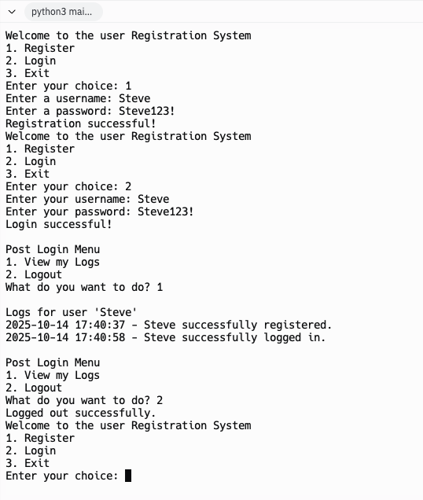
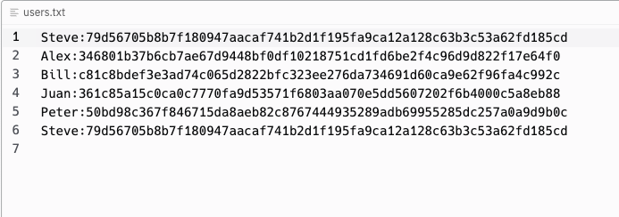
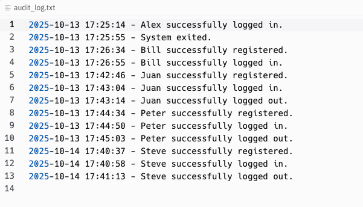

# 🔐 Python Authentication System & Password Checker

A Python-based authentication system designed to handle secure user sign-up, login, and password strength verification.

I built this project as part of my cybersecurity learning journey to better understand how authentication works at a foundational level while gaining skills using Python.

---

## 🧰 Project Overview

This tool allows users to:
- **Register** with a username and password.
- **Authenticate** existing users through a login process.
- **Validate password strength** against basic security standards such as minimum length and complexity.
- **Audit user activity** by recording events in log files for tracking and testing purposes.

User credentials are hashed with SHA-256 using the hashlib module and stored in a text file (`users.txt`) and validated at runtime.  
The system is designed to be modular so it can be expanded with more security features (e.g., hashing algorithms, encryption, or database storage).

---
## 🛠️ How I Built This Project

This project is part of my hands-on learning in cybersecurity and Python development. I followed the “Mastering Cybersecurity with Python — From Basics to Advanced Defense”
 video training course to understand how to build a secure authentication system and password checker from the ground up.

⚠️ Important: Although I used Replit as my development environment, I did not use its AI assistant. Every step of this project was manually implemented as I followed and understood the concepts presented in the course. I focused on understanding how each component works and why it’s implemented in a particular way.

🧠 ***Topics Covered in the Course:***

Python fundamentals for security use cases

Variables & Data Types

How to work with Strings

Controlling Flow & Loops

Functions

Data Structures

File handling

Libraries & Modules

Object-Oriented Programming (OOP)

By completing this project, I gained hands-on experience in applying Python to security tasks, building secure systems, and writing clear, structured code that follows best practices.

## 🖼️ Screenshots

Here’s a look at the Python Authentication System:








---

## 🧠 What I Learned

Working on this project helped me:
- Understand **how authentication systems work** at a basic level.
- Implement **input validation** and **password strength checks**.
- Use hashlib to add **password hashing**.
- Setup an audit feature to **log events**.
- Work with **file I/O** for storing and retrieving user data.
- Explore **basic security principles** like password handling and why plaintext passwords should be avoided.
- Gain experience in **structuring, editing, and testing code** to implement changes safely.
- Structure Python code in a modular way to support future improvements.

---

## ⚡ Future Improvements

- Integrate a lockout mechanism after failed login attempts.
- Store credentials in a secure database instead of a flat file.

---

## 🧑‍💻 How to Run

1. Clone the repository:
   ```bash
   git clone https://github.com/e-salinas/Python_AuthenticationSystemandPasswordChecker.git

> ⚠️ **Disclaimer:**  
> This project was created for educational and demonstration purposes only.  
> It is not intended for production use or to handle real user credentials.  
> Always follow secure development best practices in real-world applications.

